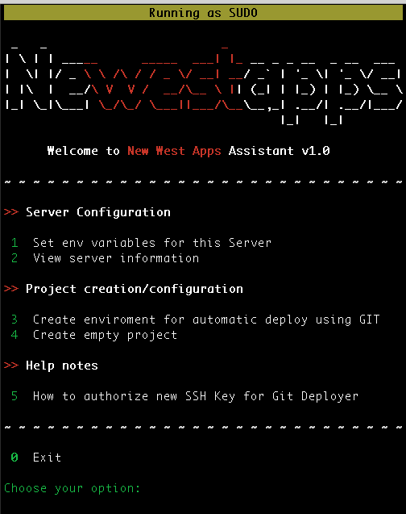

##Installation

Execute the script below anywhere in the target server.

`sudo curl sudo curl https://raw.githubusercontent.com/newestapps/nw-cli/master/install.sh | sudo /bin/bash`

##Compatibility

- Ubuntu 12+
- CentOS 6+
- OSX 10+  *(auto install of dependencies is disabled for OSX)*

##Using the cli

Run `newestapps` in your terminal to launch the cli.

##Updating the cli

The client comes with a self update method. Just run `newestapps self-update` to get the latest version.

##Screenshots

 
